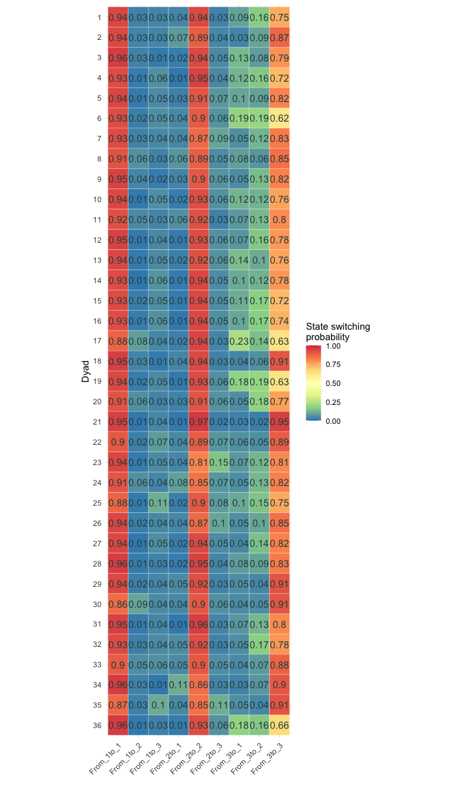
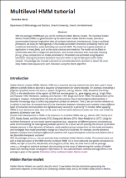
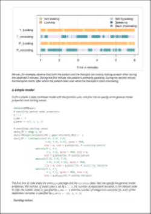
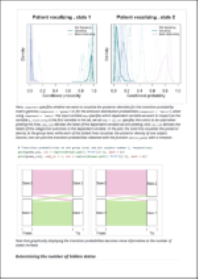
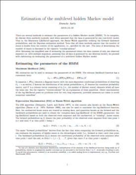
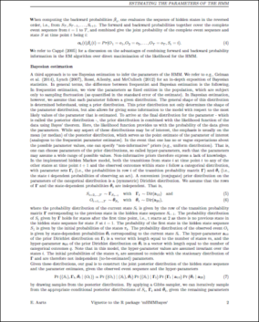
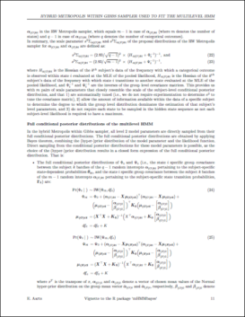

## Example: Interpersonal Interaction  

39 patient-therapist dyads

15 min annotated video recordings of therapy session

<div align="center">

</div>

## Possible research questions

- Can we extract latent interpersonal interaction states over time? 
- What are the dynamics over time in interpersonal interaction states? 
- Do patient-therapist dyads differ in their dynamics over time? 
- Can this between dyad heterogeneity be explained by, for example, depression improvement? 

## The hidden Markov model {.smaller}

<div align="center">

</div>

HMM: probabilistic model to infer hidden states $S_t \in (1, 2, ..., m)$ at 

- each time point $t = 1, 2, ..., T$ 
- from the observed series $(y_{k1}, y_{k2}, ..., y_{kT})$ 
- for dependent variable $k = 1, 2, ..., K$

## The hidden Markov model {.smaller}

<div align="center">

</div>

We assume:

- observation $y_{qt}$ is generated by an underlying, latent state $S_t$, 
- sequence of hidden states $\{S_t : t = 1, 2, ..., T\}$ forms a Markov chain: probability of switching to the next state $S_{t+1}$ only depends on the current state $S_t$: $P(S_{t_1} | S_t, S_{t-1}, ..., S_1 = P(S_{t+1} | S_t)$

## The hidden Markov model {.smaller}

<div align="center">

</div>


Two sets of parameters: 

1) probability of transitioning between latent states $\gamma_{ij}=P(S_{t+1} = j | S_t = i)$  
2) probability of emitting an observation given the current latent state $P(y_{kt} | S_t)$


## The hidden Markov model {.smaller}

<div align="center">

</div>

Given example data, assume 

- categorical emission distribution: $P(y_{kt} | S_t) \sim Cat(\theta_{ki})$
- $y_{k.}$ are conditionally independent given $\{S_t : t = 1, 2, ..., T\}$ to accommodate multivariate data

## HMM is suited for one sequence of data
Analyzing data from multiple individuals: 

- fit HMM to the data of each individual separately
- fit one and the same HMM model to the data of all individuals 
    - strong assumption: subjects do not differ with respect to HMM parameters 
- explain some of the differences using covariates (e.g., R package depmixS4)

- Does not allow (quantification of) natural variation (i.e., heterogeneity) between individuals
- Does not allow for individual specific dynamics over time

## Extending the HMM to a multilevel framework
Including a multilevel framework for the HMM, enables simultaneous estimation:

- group level parameter estimates 
- subject specific parameter estimates for each subject $n$ 

Multinomial logistic regression to estimate transition probabilities $\gamma_{nij}$ and variable & state dependent categorical probability distributions $\theta_{nkiq}$:

$\gamma_{nij} = \frac{\text{exp}(\alpha_{nij})}{1 + \sum_{{j} = 2}^m \text{exp}(\alpha_{ni{j}})} \quad$ and $\quad {\theta_{nkiq} = \frac{\exp{(\beta_{nkiq})}}{1 + \sum_{l=2}^{Q} \exp{(\beta_{nkil})}}}$

where $\alpha_{nij} = \bar{\alpha}_{ij} + \epsilon_{\left[\alpha\right]nij}$ and $\beta_{nkiq} = \bar{\beta}_{kiq} + \epsilon_{\left[\beta\right]nkiq}$

Adopt a Bayesian approach


## The mHMMbayes package: an example

39 patient-therapist dyads

15 min annotated video recordings of therapy session

<div align="center">

</div>


## Fitting a simple model - input

Fitting a 3 state multilevel hidden Markov model on the nonverbal data: 

```{r settings and load 2 state model, include = FALSE}
library(mHMMbayes)
## specifying general model properties:
m <- 3     # number of hidden states
n_dep <- 6     # number of dependent input variables
q_emiss <- c(3, 2, 2, 3, 2, 2)   # number of categories within each dep var

# specifying starting values
start_TM <- diag(.9, m)
start_TM[lower.tri(start_TM) | upper.tri(start_TM)] <- .05
start_EM <- list(matrix(c(0.70, 0.20, 0.10, # vocalizing therapist
                           0.05, 0.90, 0.05,
                           0.25, 0.70, 0.05), byrow = TRUE, nrow = m, ncol = q_emiss[1]), 
                  matrix(c(0.15, 0.85, # looking therapist
                           0.35, 0.65,
                           0.30, 0.70), byrow = TRUE, nrow = m, ncol = q_emiss[2]), 
                  matrix(c(0.80, 0.20, # leg therapist
                           0.80, 0.20,
                           0.80, 0.20), byrow = TRUE, nrow = m, ncol = q_emiss[3]), 
                  matrix(c( 0.10, 0.80, 0.10, # vocalizing patient
                            0.90, 0.05, 0.05,
                           0.85, 0.05, 0.10), byrow = TRUE, nrow = m, ncol = q_emiss[4]), 
                  matrix(c(0.30, 0.70, # looking patient
                           0.10, 0.90,
                           0.50, 0.50), byrow = TRUE, nrow = m, ncol = q_emiss[5]), 
                  matrix(c(0.70, 0.30, # leg patient
                           0.90, 0.10,
                           0.35, 0.65), byrow = TRUE, nrow = m, ncol = q_emiss[6])) 

load("out_vll_3stV3_depr_stc.Rda")
out_3st <- out_vll_3stV3_depr_stc
```

```{r show specifying 2 state model, eval = FALSE}
library(mHMMbayes)

## specifying general model properties:
 # number of states m
m <- 3
 # number of dependent variables
n_dep <- 6
 # number of output categories for each dependent var
q_emiss <- c(3, 2, 2, 3, 2, 2) 

``` 

## Fitting a simple model - input
```{r}
## specifying starting values
 # Start values of the TPM
start_TM <- diag(.9, m)
start_TM[lower.tri(start_TM) | upper.tri(start_TM)] <- .05

 # Start values for the emission distribution
start_EM <- list(matrix(c(0.70, 0.20, 0.10, # vocalizing therapist
                           0.05, 0.90, 0.05,
                           0.25, 0.70, 0.05), byrow = TRUE, nrow = m, ncol = q_emiss[1]), 
                  matrix(c(0.15, 0.85, # looking therapist
                           0.35, 0.65,
                           0.30, 0.70), byrow = TRUE, nrow = m, ncol = q_emiss[2]), 
                  matrix(c(0.80, 0.20, # leg therapist
                           0.80, 0.20,
                           0.80, 0.20), byrow = TRUE, nrow = m, ncol = q_emiss[3]) 
                  # continue emission probs here for the three other variables
                 ) 
```

## Fitting a simple model - input
```{r show fitting 2 state model, eval = FALSE}
# Run a model without covariate(s) and default priors:
out_3st <- mHMM(s_data = MHMM_nonverbal,
                            gen = list(m = m, n_dep = n_dep, q_emiss = q_emiss),
                            start_val = c(list(start_TM), start_EMc),
                            mcmc = list(J = J, burn_in = burn_in))

```

## Model output - print()
```{r}
out_3st
```


## Model output - summary()
```{r}
summary(out_3st)
```


## State composition - obtain_emiss()
```{r, eval = FALSE}
emiss_pop <- obtain_emiss(out_3st)
```

<div align="center">

</div>


## State dynamics - obtain_gamma()
```{r, eval = FALSE}
gamma_pop <- obtain_gamma(out_3st)
```

<div align="center">
<br>

</div>

## State dynamics - obtain_gamma()
```{r, eval = FALSE}
gamma_pop <- obtain_gamma(out_3st)
```

<div align="center">
<br>

</div>

## State dynamics at dyad level - obtain_gamma()
```{r, eval = FALSE}
gamma_subj <- obtain_gamma(out_3st, level = "subject")
```

<div align="center">
<br>

</div>

## Explaining heterogeneity - including covariate(s)
```{r show fitting cov 2 state model, eval = FALSE}
# Run a model WITH covariate(s) and default priors:
out_3st_cov <- mHMM(s_data = MHMM_nonverbal,
                            gen = list(m = m, n_dep = n_dep, q_emiss = q_emiss),
                            xx = c(list(xx_depr), vector(mode = "list", length = n_dep)),
                            start_val = c(list(start_TM), start_EMc),
                            mcmc = list(J = J, burn_in = burn_in))

```


## Explaining heterogeneity - including covariate(s)

<div align="center">
<br>

</div>

## Predicted state dynamics

<div align="center">
<br>

</div>

## Predicted state dynamics

<div align="center">
<br>

</div>

## Inferred state sequence - vit_mHMM()
```{r, eval = FALSE}
state_seq_3st <- vit_mHMM(out_3st_cov, s_data = MHMM_nonverbal)
```

<div align="center">
<br>

</div>


## Example II: isolating CAB crisis states

## Example II: isolating CAB crisis states
<div align="center">

</div>

## Four CAB based crisis states
<div align="center">
<br>
<br>
<br>
<br>

</div>

## Personalized dynamics and trajectories
<div align="center">

</div>

## R package wrap up
- mHMMbayes fits multilevel hidden Markov models using Bayesian estimation 
- Allows for heterogeneity between subjects, while estimating one overall HMM
- The model accommodates multivariate data 
- The model accommodates individual level covariates 

 
- The package also includes  
    - various automated plotting functions
    - function to simulate data
    - function to obtain the most likely hidden state sequence for each individual using the Viterbi algorithm. 


## Vignettes: tutorial
    

## Vignettes: estimation methods
  


## Thank you

Thank you for your attention!

<br><br>

https://cran.r-project.org/web/packages/mHMMbayes

https://github.com/emmekeaarts/mHMMbayes

<br>

Questions? -> E.Aarts\@uu.nl


## Determining the number of hidden states

Table 1. Model fit and convergence

+----------------------------+---------------+---------------+---------------+
|                            | 2 state model | 3 state model | 4 state model |
+============================+===============+===============+===============+
| AIC                        | 4759          | 4460          | 4310          |
+----------------------------+---------------+---------------+---------------+
| Mean Rhat (\% > 1.2)       |               |               |               |
+----------------------------+---------------+---------------+---------------+
| State transition           | 1.03 (0\%)    | 1.11 (0\%)    | 1.15 (25\%)   |
| parameters                 |               |               |               |
+----------------------------+---------------+---------------+---------------+
| State composition          | 1.05 (4\%)    | 1.11 (5\%)    | 1.17 (29\%)   |
| parameters                 |               |               |               |
+----------------------------+---------------+---------------+---------------+

## How much data?

Use multivariate data!
Fixed (group-level parameters) only: 

- low complexity: 
    a) 400 obs for 2 dep var on 5 subjects 
    b) 800 obs for 1 dep var on 5 subjects 
    c) 400 obs for 1 dep var in 30 subjects
- high complexity: 
    a) 800 obs for 4 dep var on 5 subjects
    b) 1600 obs for 2 dep var on 5 subjects
    c) 1600 obs for 1 dep var on 30 subjects

Heterogeneity between subjects: focus on number of subjects, at least 30 subjects and 2 dep var. 

## mHMM Metropolis within Gibbs sampler

1. Obtain forward probabilities $\alpha_{t(ni)} = Pr\big(O_1 = o_1, ..., O_t = o_t, S_t = i\big)$ for each subject using current values of subject specific model parameters.
2. Sample hidden state sequences in backward manner using $\alpha_{t(ni)}$ and $\gamma_{nij}$.
3. Given current subject-specific parameters, draw new group-level parameter estimates using Gibbs step
4. Given 
    - observed event sequence for each subject
    - sampled hidden state sequence for each subject
    - group-level parameter distributions
    - draw new subject-specific parameters using Random Walk (RW) Metropolis sampler
5. Repeat step 1-4 a very large number of times

## Model output - posterior densities
```{r plotting post dens, echo = FALSE}
library(RColorBrewer)
Voc_col <- c(brewer.pal(3,"PuBuGn")[c(1,3,2)])
Voc_lab <- c("Not Speaking", "Speaking", "Back channeling")
```

```{r, fig.height=4, fig.width=7, fig.align="center"}
plot(out_3st, component = "emiss", dep = 1, col = Voc_col, 
     dep_lab = c("Patient vocalizing"), cat_lab = Voc_lab)
```

## Model output - posterior densities
```{r, echo = FALSE}
library(RColorBrewer)
Voc_col <- c(brewer.pal(3,"PuBuGn")[c(1,3,2)])
Voc_lab <- c("Not Speaking", "Speaking", "Back channeling")
```

```{r, fig.height=4, fig.width=7, fig.align="center"}
plot(out_3st, component = "emiss", dep = 4, col = Voc_col, 
     dep_lab = c("Therapist vocalizing"), cat_lab = Voc_lab)
```


## Estimation of the HMM - Bayesian

Advantages:

- Bayesian methods yield many additional metrics, such as standard errors and credibility intervals, much harder to extract using frequentist methods.
- Easy to handle missing data.
- Allowing incorporation of prior knowledge (through prior distribution specification) accommodates smaller sample sizes. 
- Adds flexibility, making it relatively easy to extent to more complex models. 


