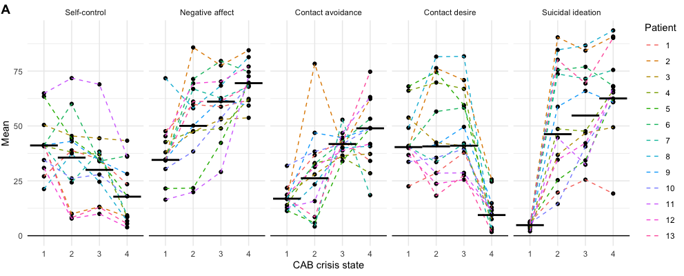
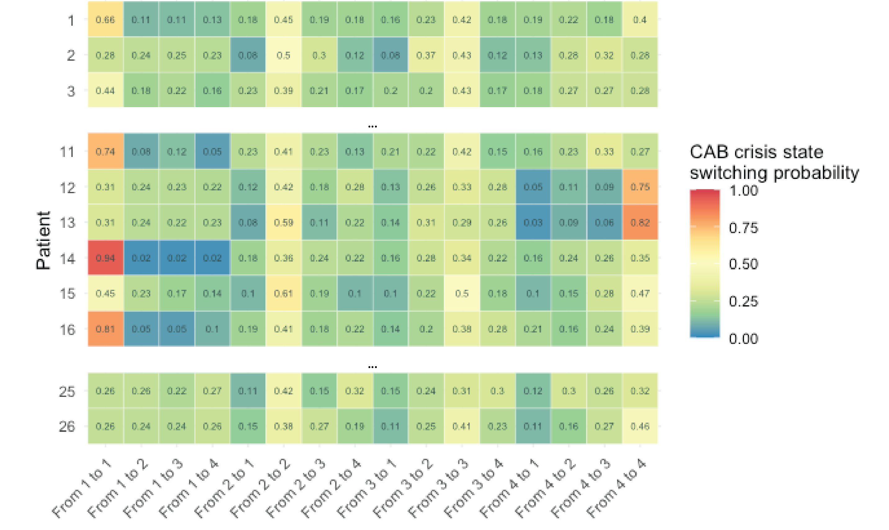
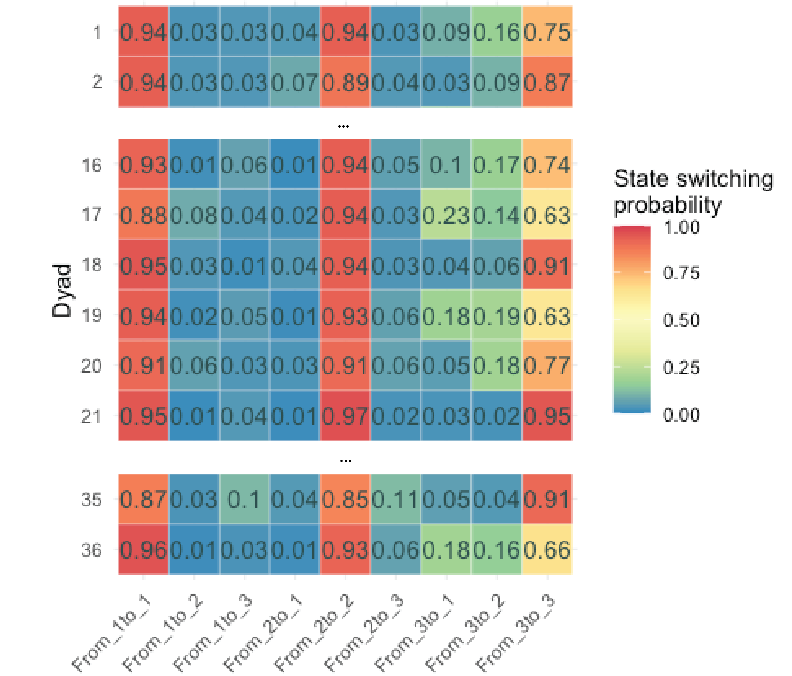
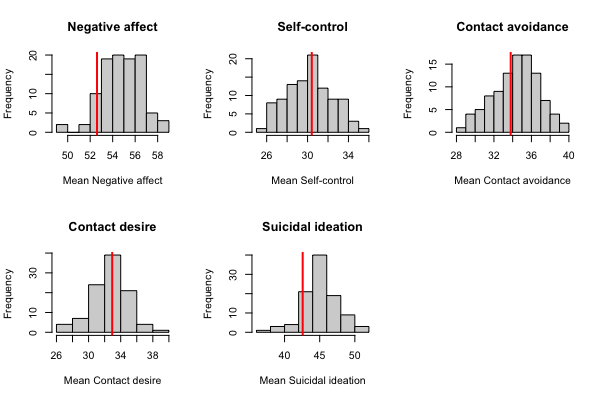
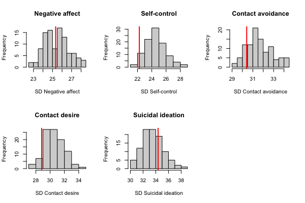

```{r setup, include=FALSE}
knitr::opts_chunk$set(echo = FALSE)
library(mHMMbayes)
library(ggplot2)
```

## So far.. 

Introduction to the multilevel HMM 

Two examples: 

- Continuous outcomes: CAB crisis states
- Categorical outcomes: nonverbal states in patient-therapist dyads 

Here, we investigated 

- State composition at the group level
- State dynamics at the group level
- Most likely state sequence over time

Same topics in the practical, using data on mood (continuous data). 

---

<div align="center">
<br>
<br>
<br>
<font size="10"> **Model selection**</font>
<br>
<br>
<br>
<br>
<font size="6"> A pragmatic step by step approach </font>
</div>

## Model selection: how many states? 

Number of states is a fixed 'parameter' in the model, to be determined by the researcher. 

- AIC and BIC tend to favor models with (undesirably) large numbers of states. 

<div>
<br>
<br>
<br>
<br>
<br>
<br>
<br>
<font size="4">
Note: within Bayesian framework, can make the number of states a model parameter using a reversible jump MCMC algorithm, but within the context of a multilevel model, computationally too intense. </font>
</div>

## Model selection: how many states? 

Pohle & Langrock (2017) suggested a pragmatic step-by-step approach: 

- Decide a priori the min and max number of states that seem plausible.
- Fit the decided on models.
- Inspect the state composition of the fitted models.
- Use model checking to include / exclude models.  
    - In case of Bayesian framework: model convergence!
- Consider model selection criteria for guidance.
- Make a choice, also based on **study aim and expert knowledge**, and computational considerations. 
- When no clear preference, report all (viable) models.

## Model selection: example

<div align="center">
<br>

</div>


## Model selection: state composition

<div align="center">

</div>

## Model selection: state composition

<div align="center">

</div>

## Model selection: state composition

<div align="center">

</div>

## Model selection: state composition

<div align="center">

</div>

## Model selection: convergence

| Mean Rhat (\% $>$ 1.2)   | 2-state model| 3-state model| 4-state model| 5-state model|
| :----------------------: | :----------: | :----------: | :----------: |:-----------: |
|                          |              |              |              |
| Transition parameters    | 1.04 (0.0\%) |	1.02 (0.0\%) | 1.01 (0.0\%) |	1.01 (0.0\%) |
| Composition parameters   | 1.04 (0.0\%) | 1.04 (0.1\%) | 1.01 (0.0\%) | 1.03 (0.0\%) |


## Model selection: model selection criteria
```{r, fig.align='center', fig.width=8, fig.height=4}
AIC <- data.frame(AIC = c(2663.50, 2632.81, 2621.72, 2633.38), 
                  states = c(2:5))
ggplot(AIC, mapping = aes(x = states, y = AIC)) +
  geom_point() + 
  geom_line() +
  ggtitle("AIC over the 2 - 5 state models") + 
  xlab("Number of states") +
  theme_minimal()
```

---

<div align="center">
<br>
<br>
<br>
<font size="10"> **Subject specific parameters**</font>
<br>
<br>
<br>
<br>
<font size="6"> Emission distribution and transition probability parameters </font>
</div>

## Subject level parameters 

Subject specific parameters (means / intercepts) are sampled from a Normal distribution, combining: 

- The prior distribution: the group level distribution denoting the overall mean of the parameter over subjects, and the variability in the parameter between subjects
- The 'observed data': the observed data within a state

## Subject level parameters - emission distribution 

```{r, echo = TRUE, eval = FALSE}
emiss_subj <- obtain_emiss(CAB_mHMM_4st, level = "subject")
```

<div align="center">
<br>
<br>

</div>

## Subject level parameters - emission distribution 

Important to check conceptual state equivalence over subjects! 

<div align="center">
<br>

</div>

## Subject level parameters - transition probabilities 
```{r, echo = TRUE, eval = FALSE}
gamma_subj <- obtain_gamma(CAB_mHMM_4st, level = "subject")
```

<div align="center">

</div>

---

<div align="center">
<br>
<br>
<br>
<font size="10"> **Explaining heterogeneity**</font>
<br>
<br>
<br>
<br>
<font size="6">  Including covariate(s) </font>
</div>

## Interaction in patient-therapist dyads

39 patient-therapist dyads

15 min annotated video recordings of therapy session

<div align="center">

</div>

## Three nonverbal communication states

<div align="center">

</div>

## Dynamics in nonverbal communication 

<div align="center">
<br>

</div>

## Heterogeneity in state dynamics 

<div align="center">

</div>

## Explaining heterogeneity - including covariate(s)
```{r, echo = TRUE, eval = FALSE}
out_3st_cov <- mHMM(s_data = MHMM_nonverbal,
                    data_distr = "categorical",
                    gen = list(m = m, n_dep = n_dep, q_emiss = q_emiss),
                    xx = depression_improvement,        # optional list of level 2 covariates
                    start_val = c(list(start_TM), start_EMc),
                    mcmc = list(J = J, burn_in = burn_in))
```
<div align="center">

</div>

## Predicted nonverbal state dynamics

<div align="center">
<br>

</div>

## Predicted nonverbal state dynamics

<div align="center">
<br>

</div>

## Nonverbal communication state sequences

<div align="center">
<br>

</div>

---

<div align="center">
<br>
<br>
<br>
<font size="10"> **Model checking**</font>
<br>
<br>
<br>
<br>
<font size="6"> Convergence, PPCs and pseudo residuals </font>
</div>


## Model checking: convergence

Convergence needs to be assessed in order to rule out output resulting from a local (instead of global) maximum. 

Fit the multilevel HMM multiple times, using different starting values $\rightarrow$ multiple MCMC chains. 

- Keep the same sensible ordering of $\bar{\mu}_i$ or $\bar{\lambda}_i$ given data and process. 
- Values of the weakly informative prior distributions should be fixed over the chains.


## Model checking: convergence

Next, inspect the chains for evidence of non-convergence:

- Visually:   
    - Trace plots, visualizing the parameter estimates over the iterations of the MCMC sampler. The chains should not show any trend and good mixing. 
    - Density plots, visualizing the posterior distribution. Should be unimodal. 
- Numerically with the potential scale reduction factor $\hat{R}$:  
    - Tests for equality of means of the different chains - the degree to which variance (of the means) between chains exceeds what one would expect if the chains were identically distributed.
    - A value of R-hat below 1.2 is used to indicate convergence. 


## Model checking: convergence - example

<div align="center">

</div>

## Model checking: convergence - example

| Mean Rhat (\% $>$ 1.2)   | 3-state model| 
| :----------------------: | :----------: | 
|                          |              | 
| Transition parameters    | 1.02 (0.0\%) | 
| Composition parameters   | 1.04 (0.1\%) | 

## Model checking: Posterior predictive checks 

Assess whether the model recovers the data correctly on an array of characteristics and aids in revealing model missspecification.

1. Fit a MHMM to the data.
2. Generate simulated data sets based on obtained parameter estimates.
3. For each simulated data set, calculate summary statistics of interest (e.g., mean or variance) and compare to the observed data.
4. Check visually and/or construct an empirical posterior predictive value (PPV)  
    - PPV ranges from 0 to 1.   
    - Good fit: PPV takes intermediate values.
    - Poor fit: PPV takes extreme values (i.e., <0.025 or >0.975). 
    
PPCs can be used to assess model fit at both the individual and group-level.

## Model checking: PPCs - example

<div align="center">

</div>

## Model checking: PPCs - example

<div align="center">

</div>


## Model checking: Pseudo residuals 


## References 

- <font size="3"> Pohle, J., Langrock, R., Van Beest, F. M., & Schmidt, N. M. (2017). Selecting the number of states in hidden Markov models: pragmatic solutions illustrated using animal movement. Journal of Agricultural, Biological and Environmental Statistics, 22, 270-293. DOI: 10.1007/s13253-017-0283-8 </font>
